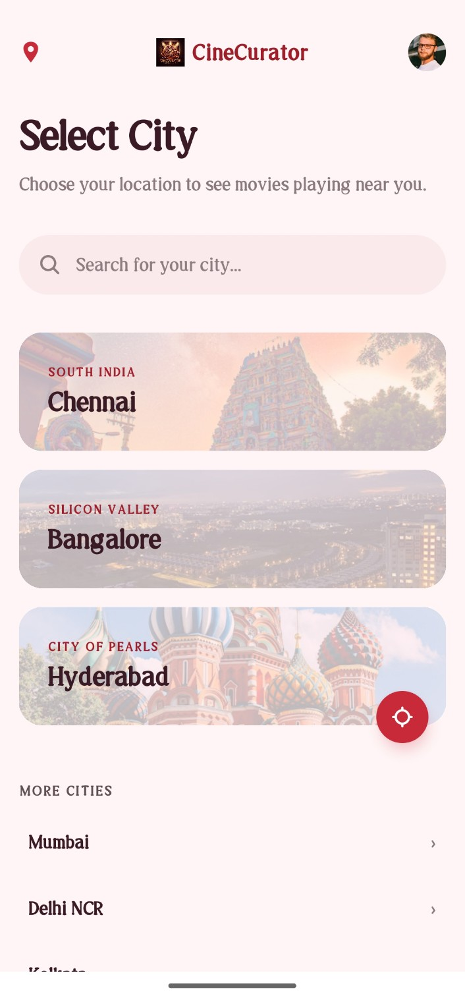
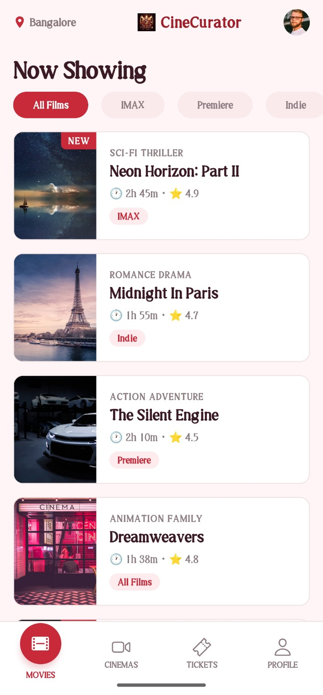
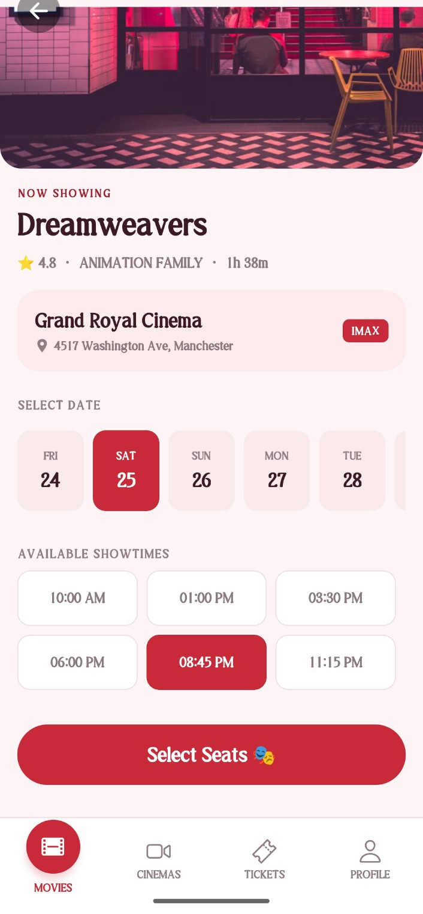
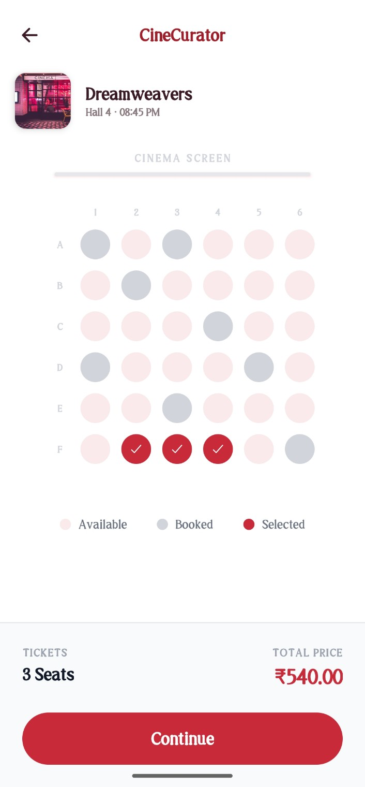
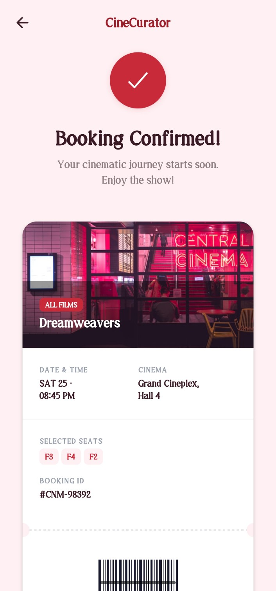

# 🎬 CineCurator — The Ultimate Real-Time Movie Experience

**CineCurator** is a high-fidelity mobile application prototype built with **Expo** and **React Native**. It delivers a premium, gold-standard experience by integrating real-time movie data, authentic posters, and live YouTube trailers into a stunning cinematic UI.

---

## 📱 App Walkthrough

### 🔐 1. Start with Security
The app kicks off with a clean, branded login screen. It ensures every booking is tied to a real account. You can use the test credentials `test123@gmail.com` / `test123` to get in instantly.


### 🌍 2. Pick Your City
Choose your location and explore a "Coming Soon" section that pulls actual anticipated movies from global databases.



### 🎭 3. Explore the Latest Hits
The main explorer pulls trending movies in real-time with smart filters for **IMAX**, **Premiere**, and **Indie** films. Every poster you see is the real deal, fetched live.



### 🎥 4. Deep Dive & Trailers
Get the full scoop on any movie—ratings, runtimes, and live plot summaries. You can even watch the official trailer directly via the YouTube integration.




### 🎟️ 5. Grab Your Seats
A surgical booking flow. Pick your date, showtime, and seats on a high-fidelity map. The "Navigation Guard" prevents accidental exits during the process.



### 🏆 6. Your Digital Ticket
A premium digital ticket integrated with your calendar and the "CineGold" loyalty system.



---

## 🚀 Key Features

*   **🔐 Auth-First Entry**: Secure login flow with test credentials.
*   **📡 Real-Time Ecosystem**: Metadata from **Trakt.tv** and real-time posters via **TVmaze**.
*   **🎥 YouTube Trailers**: Live trailer search using the **YouTube Data API v3**.
*   **🛡️ Smart Navigation**: Custom-built guard for back-gestures and app exit protection.
*   **💎 CineGold Loyalty**: Branded loyalty card with real-time stats tracking.

---

## 🛠️ Technology Stack
*   **Framework**: Expo (React Native)
*   **API Client**: Axios with custom interceptors.
*   **Services**: Trakt.tv, YouTube Data API, TVmaze.
*   **Design**: Custom Maroon & Gold Design System.

---

## 🚀 Getting Started

1.  **API Keys**: Add your keys to the `.env` file:
    *   `EXPO_PUBLIC_TRAKT_CLIENT_ID`
    *   `EXPO_PUBLIC_YOUTUBE_API_KEY`
2.  **Links**: Get your keys at [YouTube API Console](https://console.cloud.google.com/apis/library/youtube.googleapis.com).
3.  **Run**:
    ```bash
    npm install
    npx expo start
    ```

*Happy watching!*
