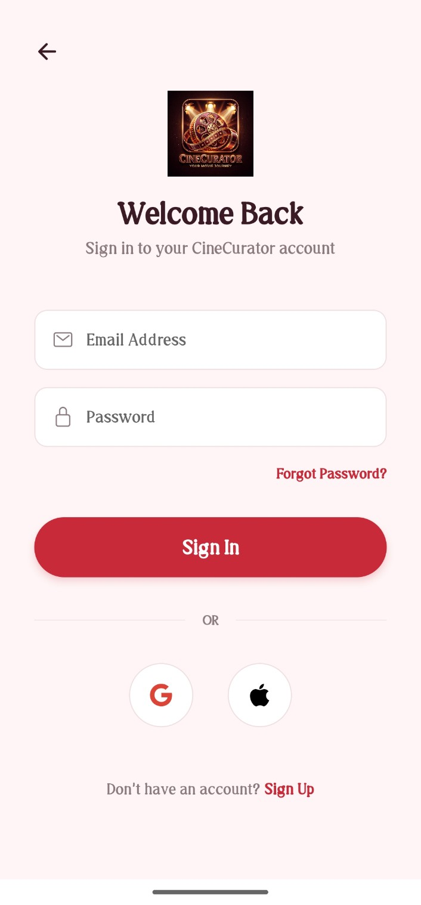
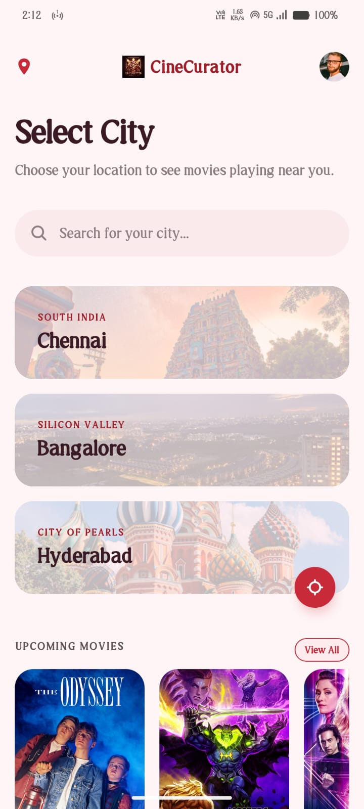
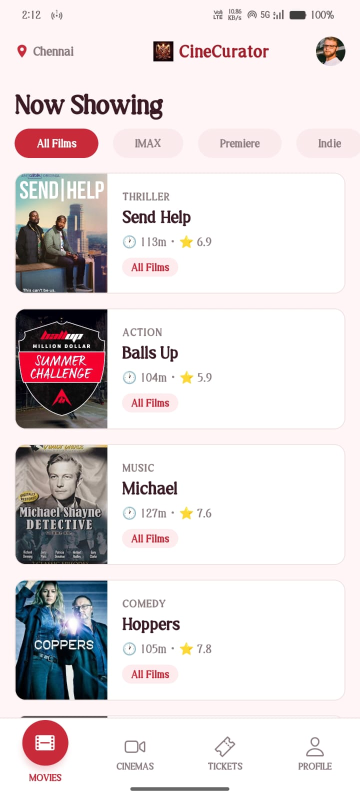
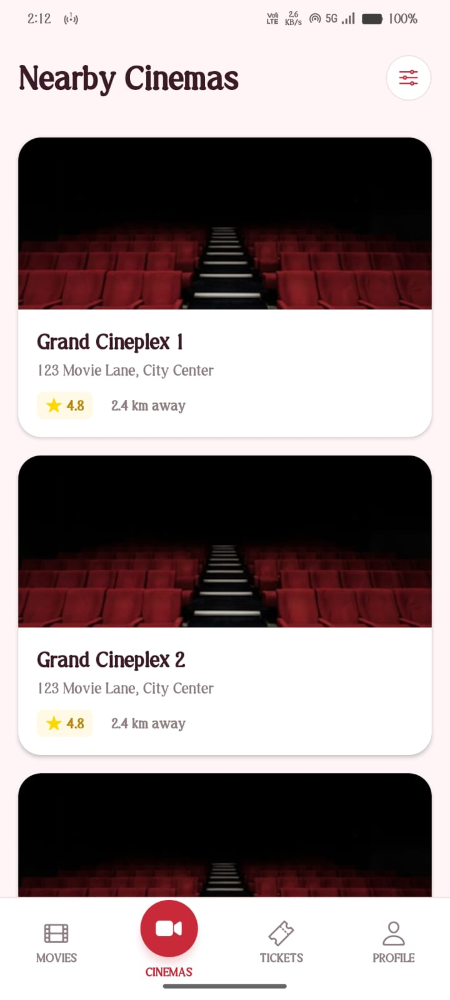
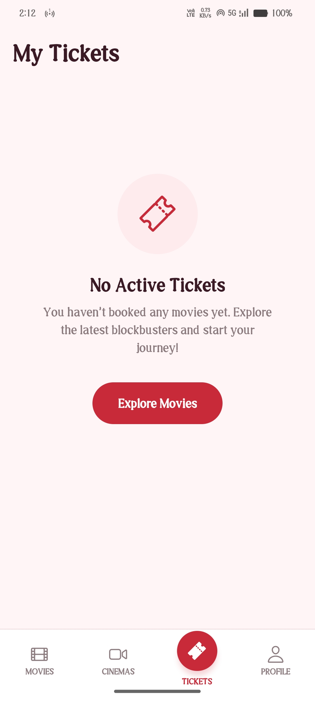
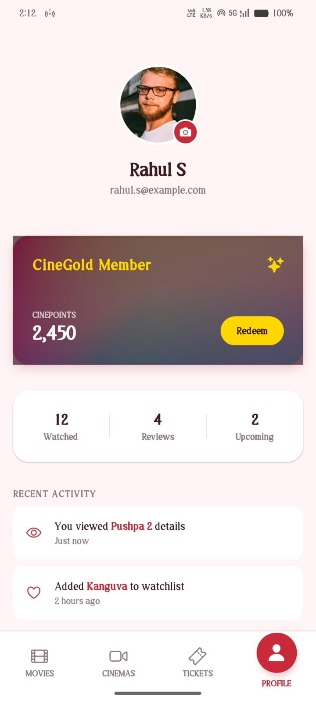
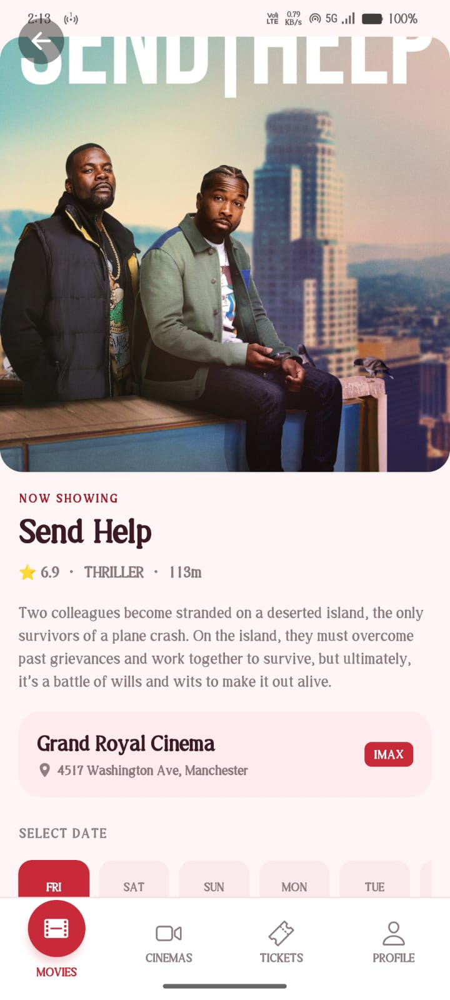
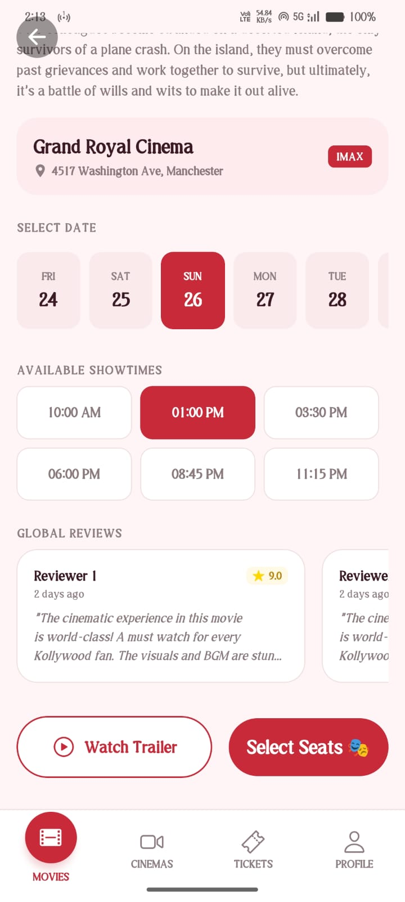
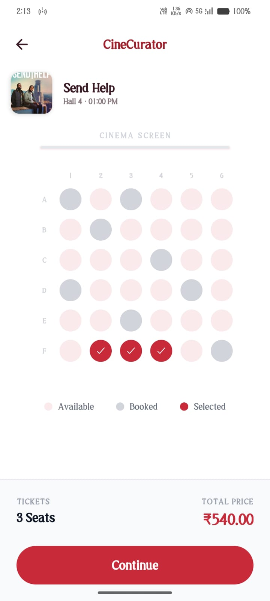
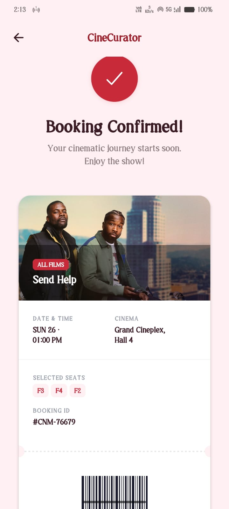

# CineCurator — Real-Time Movie Booking Ecosystem

CineCurator is a high-fidelity mobile application built with Expo and React Native, designed to provide a seamless end-to-end movie booking experience. The application integrates global real-time metadata, authentic cinematic posters, and live trailer streaming into a unified, premium user interface.

---

## Technical Overview

- **Real-Time Data**: Powered by Trakt.tv for global metadata and TVmaze for dynamic poster retrieval.
- **Video Integration**: Live YouTube trailer searching via official Data API v3.
- **Security**: Dedicated authentication-first flow with secure credential validation.
- **Navigation**: Intelligent back-handler guards and custom routing for a stable user journey.
- **Performance**: Optimized list rendering and cinematic loading states.

---

## App Interface

### Brand Identity & Authentication
The application initiates with a premium splash sequence followed by a secure login interface. This ensures that all user activity and loyalty rewards are persistently tracked.

### City Selection & Dashboard
Users select their preferred region to localize theater data. The dashboard features an "Upcoming" section that pulls the most anticipated global releases in real-time.

### Real-Time Movie Explorer
The primary discovery interface utilizes live trending data. Advanced filtering allows users to explore IMAX, Premiere, and Indie categories, all populated with authentic cinematic banners.

### Cinematic Details & Trailers
Each movie provides a deep dive into global ratings, plot summaries, and runtimes. The YouTube integration allows users to view official trailers directly within the ecosystem.

### Precision Booking Flow
The selection process includes dynamic date picking and theater localization. The seat mapping interface provides a high-fidelity view of the cinema layout with real-time status updates.

### Digital Ticket & Confirmation
Upon successful booking, a digital ticket is generated. Users can manage their reservations, add showtimes to their calendar, and track their CineGold loyalty progress.

---

## Getting Started

1.  Configure `.env` with Trakt and YouTube API credentials.
2.  Install dependencies: `npm install`
3.  Launch the environment: `npx expo start`

---
*Developed for the modern cinema enthusiast.*
